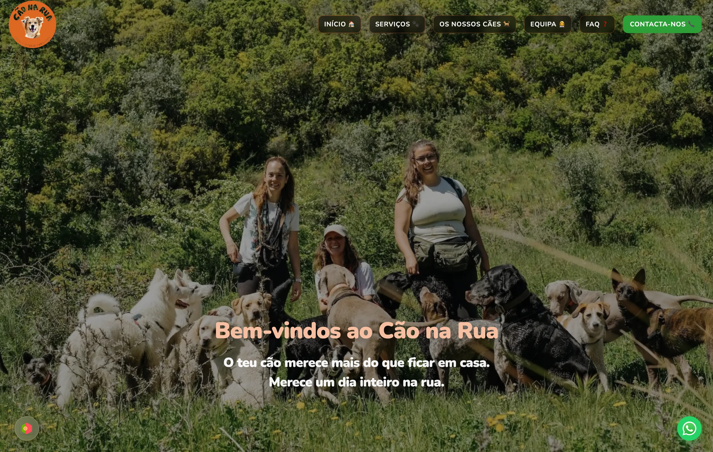
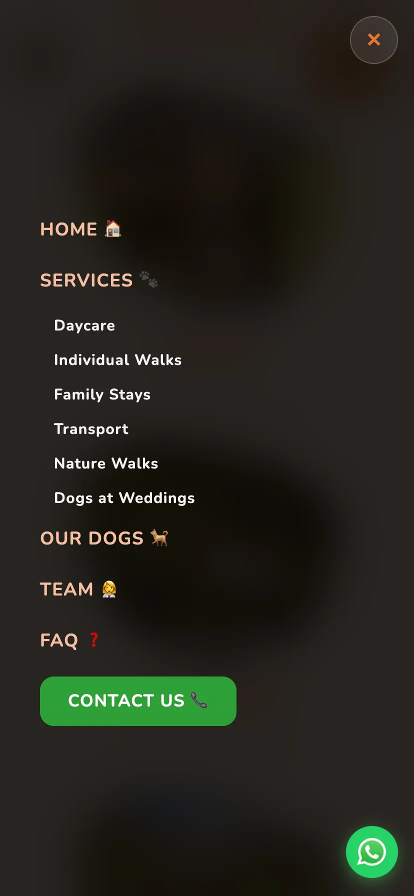
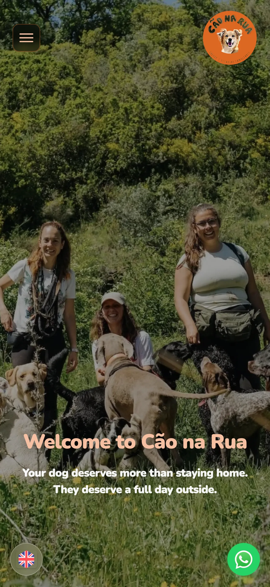
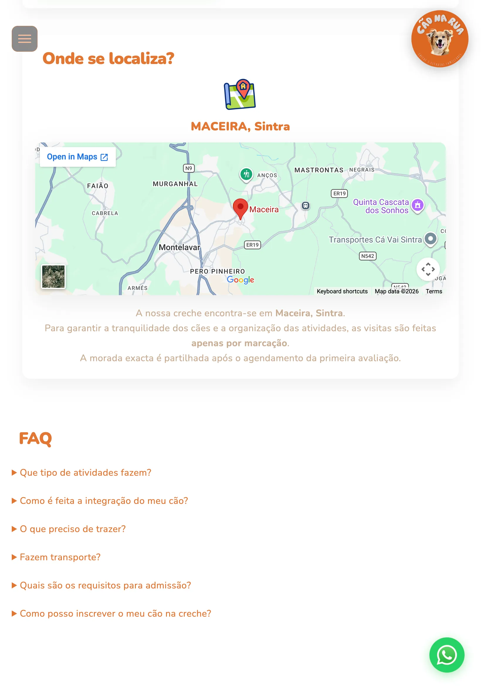
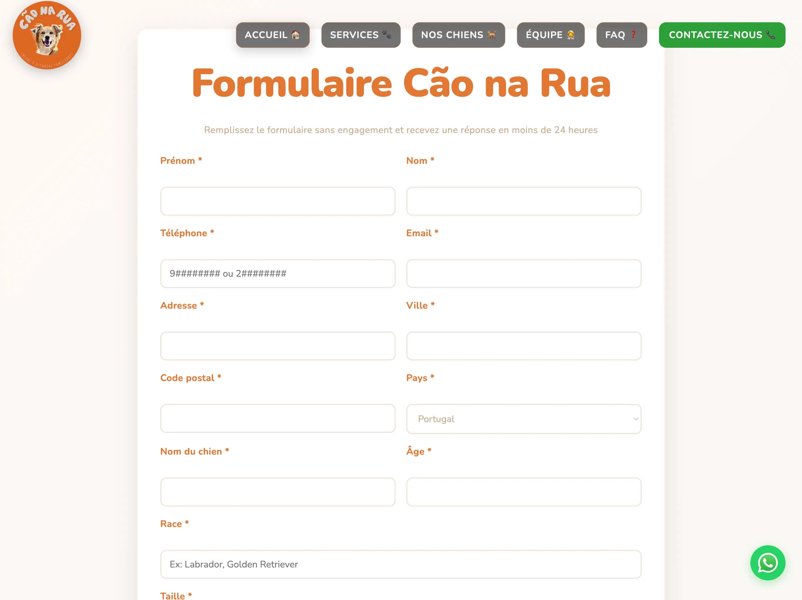

# Cão na Rua — Website

Website institucional da creche canina **Cão na Rua**, localizada em Maceira, Sintra. Comunica os serviços disponíveis (creche, passeios, estadias familiares, casamentos, transportes) e capta pedidos de contacto via formulário.

🌐 **Live:** https://caonarua.pt

## Preview



| Mobile (XR) | Mobile (iPhone 14) | Tablet (creche) | Tablet (formulário) |
|-------------|-------------------|-----------------|---------------------|
|  |  |  |  |

## Stack

- **HTML5 / CSS3 / JavaScript vanilla** — sem frameworks, sem bundler
- **4 idiomas** (PT / EN / ES / FR) com sistema de traduções em JS vanilla
- **Service Worker** para cache offline (PWA-lite)
- **Open Graph + JSON-LD** para partilha em redes sociais e SEO
- **Imagens WebP** otimizadas (max 1920px, qualidade 80) — de ~680MB para ~90MB
- **Formspree** para submissão do formulário de contacto sem backend próprio
- **PurgeCSS** para remover CSS não utilizado em produção

```
├── index.html                  # Homepage
├── creche.html
├── passeiosnanatureza.html
├── passeios-individuais.html
├── estadias-familiares.html
├── casamentos.html
├── transportes.html
├── faq.html
├── formulario.html
├── politica-privacidade.html
├── politica-cookies.html
├── termos-condicoes.html
├── caes-do-cao-na-rua.html
├── css/
│   ├── styles.css              # Stylesheet principal (~2200 linhas)
│   ├── animations.css
│   └── lang-switcher.css
├── js/
│   ├── lang-switcher.js        # Motor de traduções (PT/EN/ES/FR)
│   ├── animations.js
│   ├── cookie-consent.js
│   └── ...
├── assets/
│   ├── fotos/                  # Imagens por secção (WebP)
│   ├── logos/                  # Logótipo e ícones de navegação
│   ├── fonts/                  # Nunito + Bubblegum Sans (self-hosted)
│   ├── gifs/                   # Ícones e animações
│   └── parcerias/              # Logos de parceiros
└── service-worker.js
```

## Como correr localmente

```bash
git clone https://github.com/bertobarata/caonarua-public.git
cd caonarua-public
# Sem build step — abre directamente no browser:
open index.html
# Ou com servidor local:
python3 -m http.server 8000
```

## Decisões técnicas

**Vanilla HTML/CSS/JS** foi a escolha natural: o projecto foi construído para aprender e entregar algo real, e fazê-lo sem framework significou compreender cada linha de código escrita. Para um site institucional estático sem lógica de estado complexa, o resultado é mais simples de manter e mais fácil de auditar.

**Formspree** para o formulário eliminiu a necessidade de qualquer backend. O formulário envia os dados directamente para o serviço, que reencaminha por email — solução correcta para a escala do projecto.

## Licença

MIT — ver [LICENSE](LICENSE)
